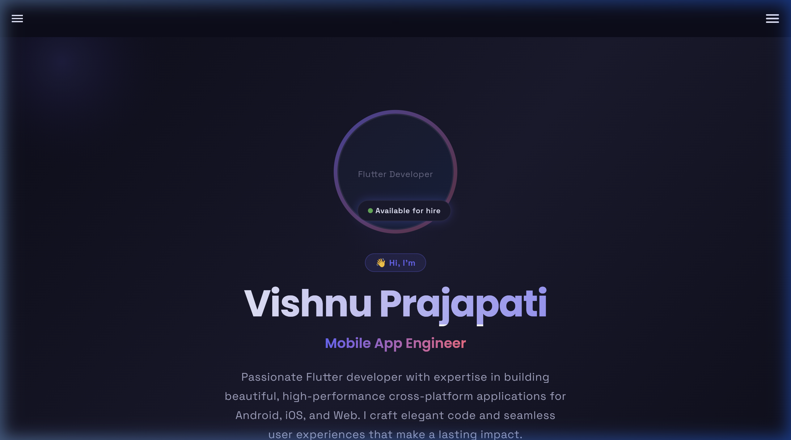
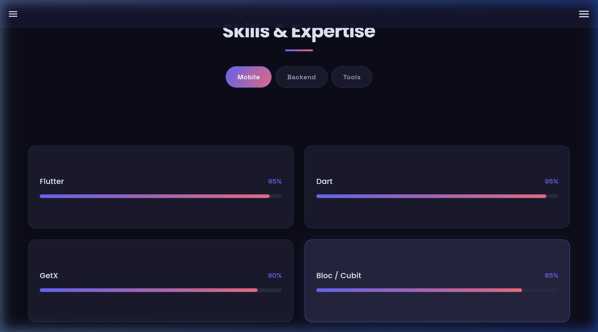
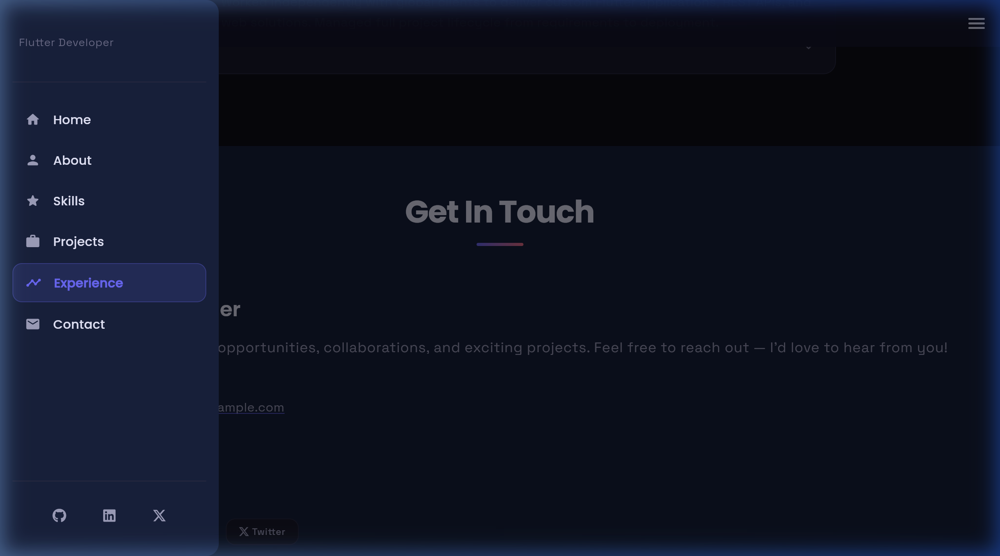
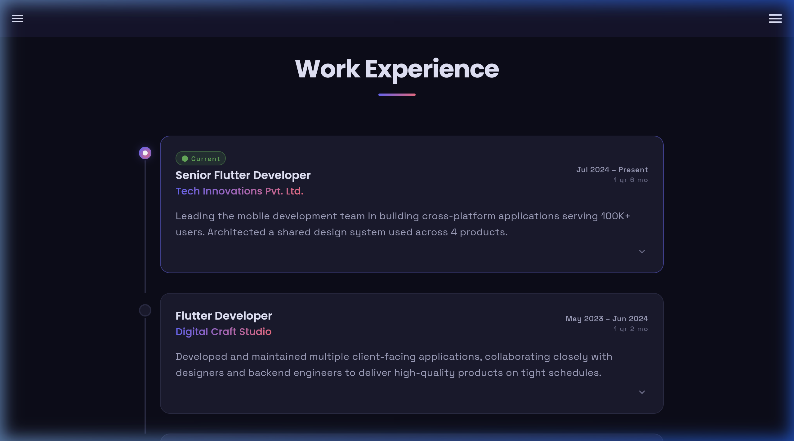

# Vishnu Prajapati — Flutter Developer Portfolio 🚀

A premium, high-performance portfolio website built using **Flutter Web** and a **Python FastAPI** backend. This project showcases a modern, responsive design with smooth animations, real-time state management, and a clean architecture.



## ✨ Key Features

- **Responsive Design**: Seamlessly transitions between Desktop, Tablet, and Mobile views.
- **Dynamic Content**: Data is served via a FastAPI backend, allowing for easy updates without redeploying the frontend.
- **Advanced Animations**: Uses `flutter_animate` and `animate_do` for premium micro-interactions and scroll-triggered transitions.
- **State Management**: Implemented with **GetX** and **BLoC** for efficient, reactive UI updates.
- **Dynamic Experience Tracker**: Automatically calculates job tenure in real-time.
- **Modern UI/UX**: Dark mode aesthetic with glassmorphism effects and custom gradient-based design system.

---

## 🛠️ Tech Stack

### Frontend (Flutter)
- **Framework**: Flutter (Web, Android, iOS)
- **State Management**: GetX, BLoC, Provider
- **Navigation**: Custom Shell routing with Smooth Scroll integration.
- **Styling**: Google Fonts (Outfit), FontAwesome, and Custom Design Tokens.

### Backend (Python)
- **Framework**: FastAPI
- **Serialization**: Pydantic models for type-safe data handling.
- **Security**: CORS middleware for cross-origin requests.

---

## 📸 Screenshots

| Projects Section | Mobile Navigation |
| :---: | :---: |
|  |  |

| Work Experience Timeline |
| :---: |
|  |

---

## 🚀 Getting Started

### Prerequisites
- Flutter SDK (`^3.10.9`)
- Python (`3.10+`)

### 1. Run the Backend
```bash
cd backend
python -m venv .venv
source .venv/bin/activate
pip install -r requirements.txt
python main.py
```

### 2. Run the Frontend
```bash
flutter pub get
flutter run -d chrome
```

---

## 📬 Contact

- **Email**: [orewavishnuprajapati@gmail.com](mailto:orewavishnuprajapati@gmail.com)
- **LinkedIn**: [Vishnu Prajapati](https://in.linkedin.com/in/vishnu-prajapati-085b15366)
- **GitHub**: [@VCodes0](https://github.com/VCodes0)

---
*Made with ❤️ by Vishnu Prajapati*
